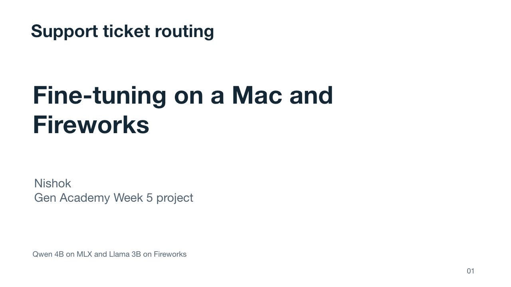
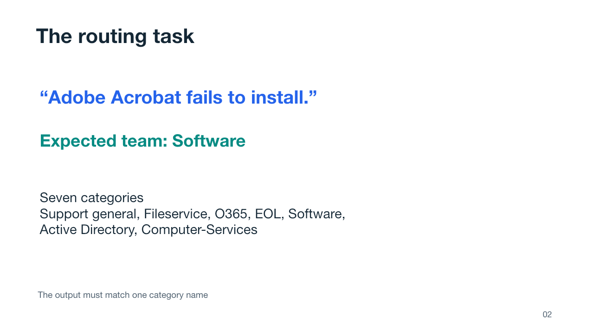
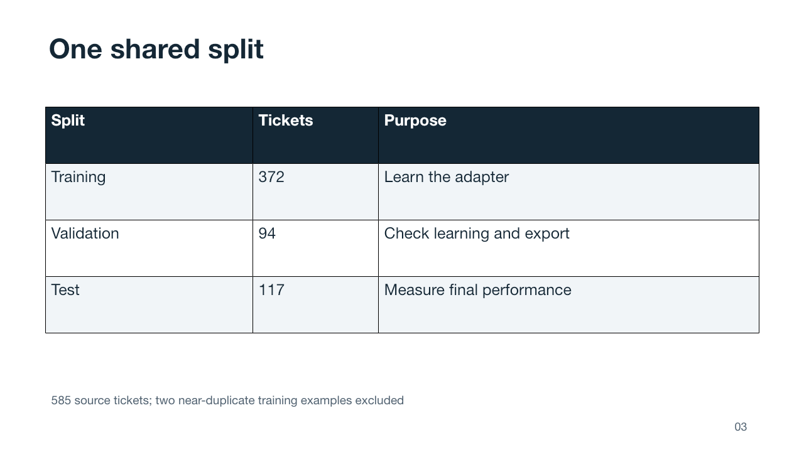
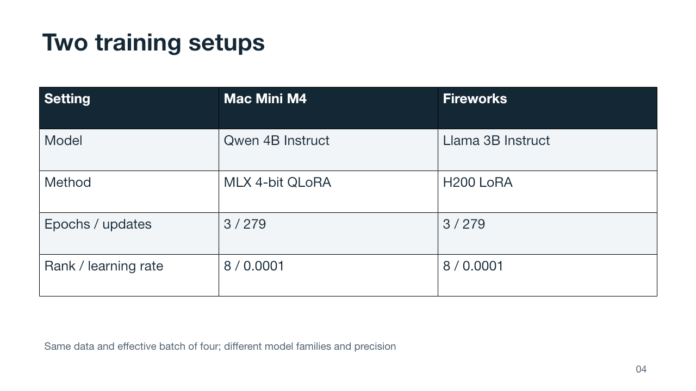
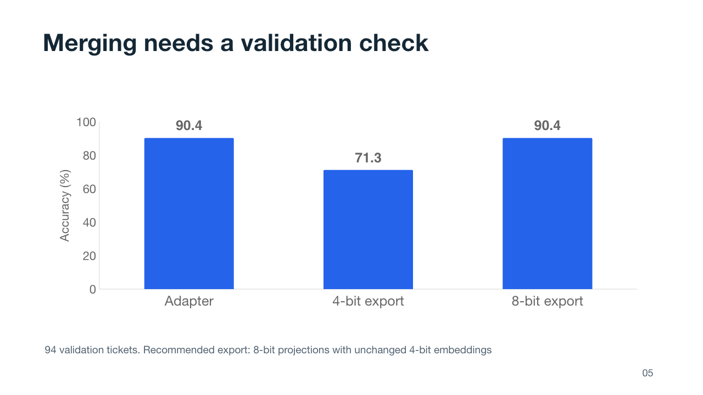
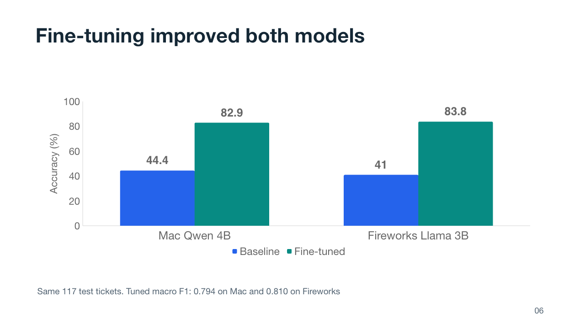
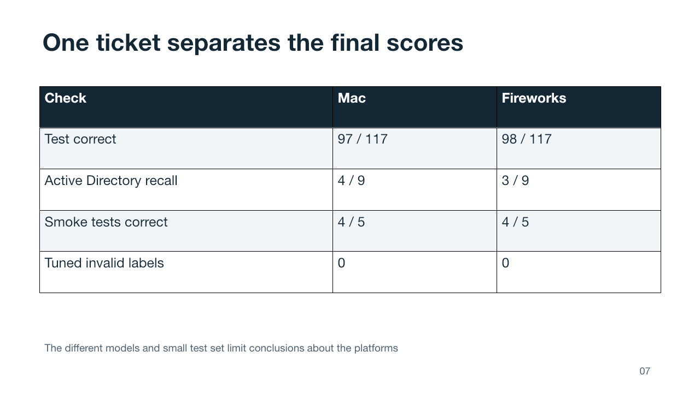
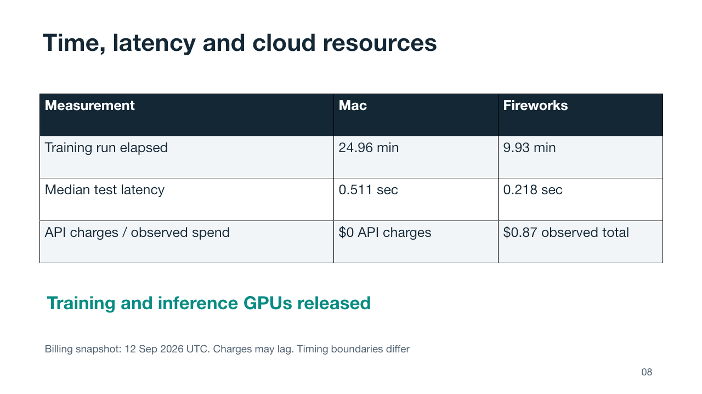
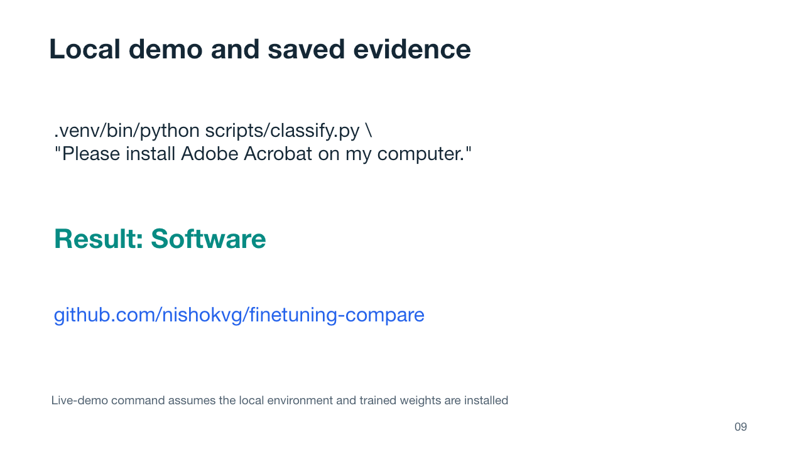
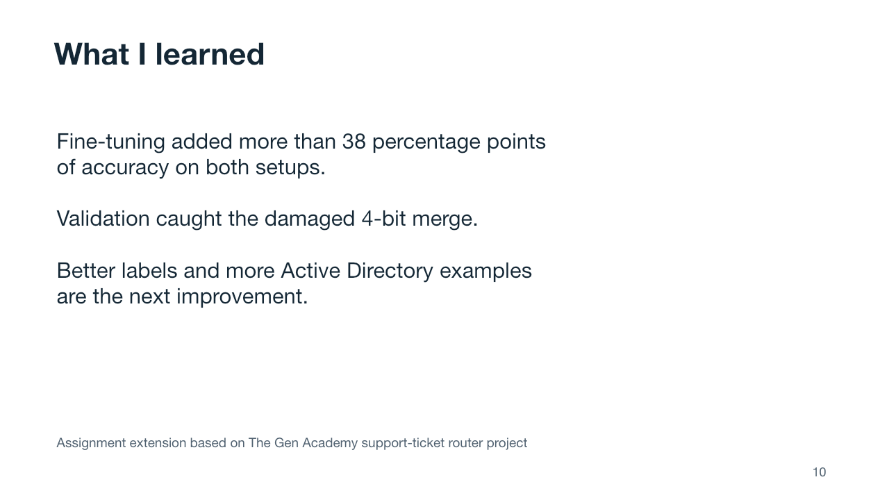

# Presentation and recording

Open [Support_Ticket_Router_Presentation.pptx](Support_Ticket_Router_Presentation.pptx) in PowerPoint or Keynote. The deck contains ten slides, editable data charts and tables, and narration in the speaker notes.

Read [VIDEO_SCRIPT.md](VIDEO_SCRIPT.md) for a matching six-minute script. Allow extra time for the terminal demo on slide 9. [slides.json](slides.json) preserves the slide text, narration and source references.

## Slide previews

### Slide 1

### Slide 2

### Slide 3

### Slide 4

### Slide 5

### Slide 6

### Slide 7

### Slide 8

### Slide 9

### Slide 10

