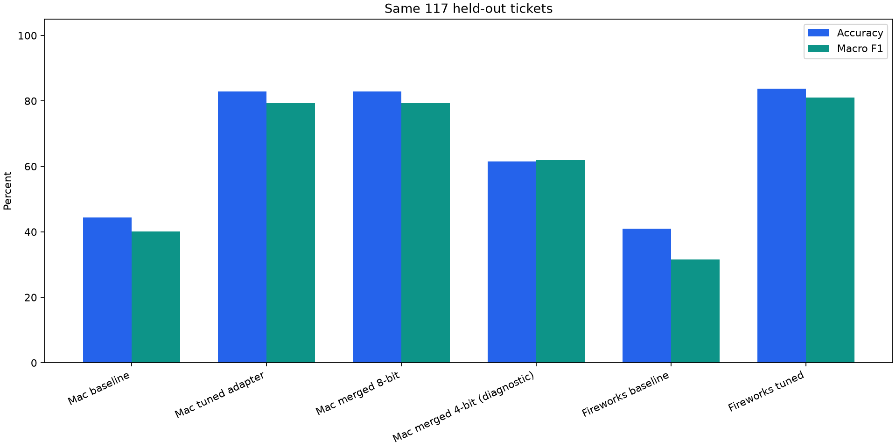
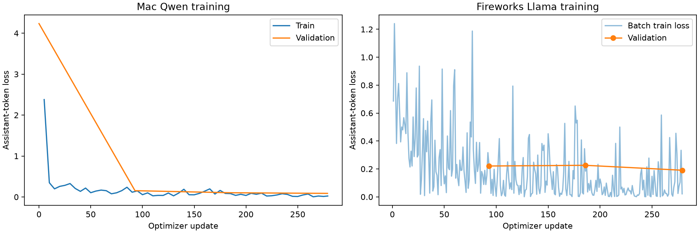
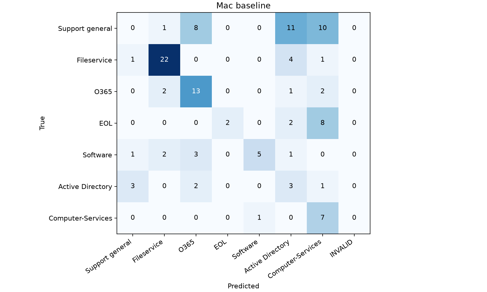
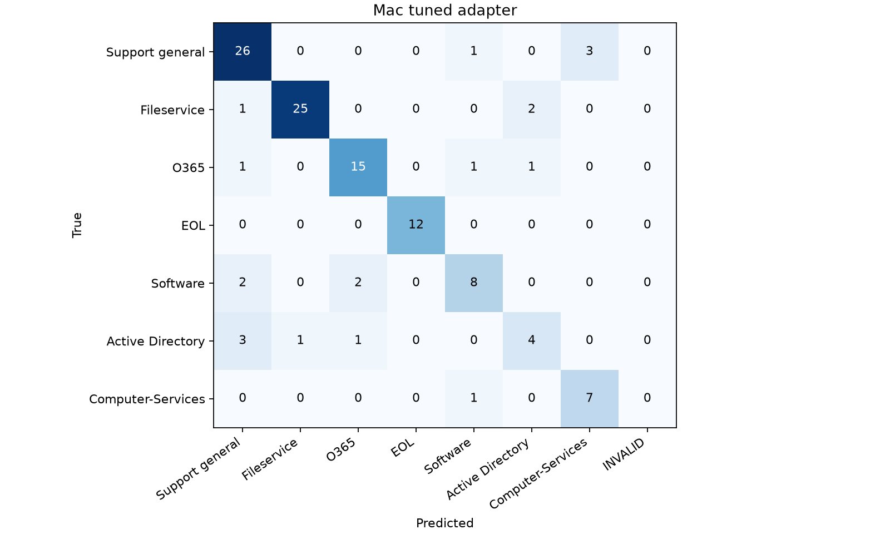
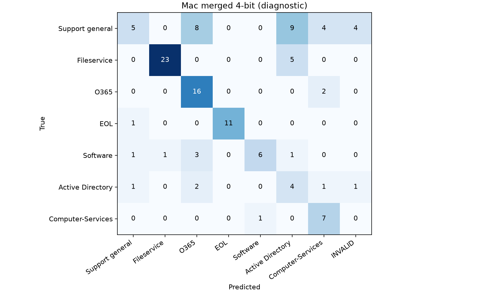
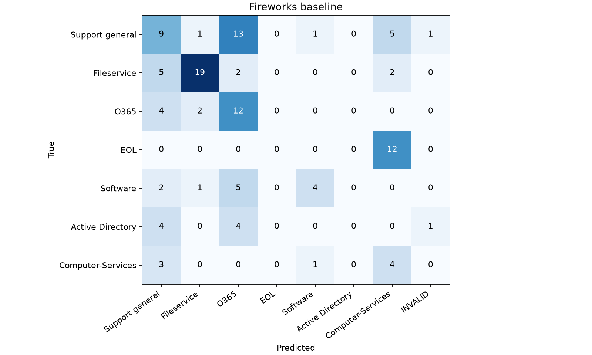

# Support ticket router: measured comparison

Both experiments are complete; the cloud training and inference resources have been released.

**This compares two practical setups:** Mac Mini M4 (16 GB) with Qwen3-4B-Instruct-2507 and Fireworks with Llama-3.2-3B-Instruct. It is not a controlled hardware benchmark or an exact reproduction of the assignment’s Qwen3-1.7B-Base experiment.

## Held-out test results

| Run | Correct / 117 | Accuracy | Macro F1 | Invalid | Median seconds | p95 seconds |
|---|---:|---:|---:|---:|---:|---:|
| Mac baseline | 52 | 44.4% | 0.401 | 0 | 0.446 | 0.520 |
| Mac tuned adapter | 97 | 82.9% | 0.794 | 0 | 0.541 | 0.623 |
| Mac merged 8-bit | 97 | 82.9% | 0.794 | 0 | 0.511 | 0.604 |
| Mac merged 4-bit (diagnostic) | 72 | 61.5% | 0.620 | 5 | 0.457 | 0.563 |
| Fireworks baseline | 48 | 41.0% | 0.315 | 2 | 0.222 | 0.282 |
| Fireworks tuned | 98 | 83.8% | 0.810 | 0 | 0.218 | 0.239 |

**Mac fine-tuning gain: +38.5 percentage points accuracy; +0.393 macro F1.**

**Fireworks fine-tuning gain: +42.7 percentage points accuracy; +0.495 macro F1.**

The cloud tuned model differs from the recommended Mac export by **+0.9 percentage points** on this test. Model family, size, precision and implementation all differ, so that difference cannot be attributed to Fireworks or the GPU alone.

The Mac alone was correct on **6 tickets**; Fireworks alone was correct on **7**. The net advantage is only one ticket and does not establish a reliable overall winner. Active Directory recall remained weak: Mac **4/9**, Fireworks **3/9**. Fireworks’ higher overall score does not mean every category improved.

## Data and evaluation method

585 source tickets, seven service categories; 372 train / 94 validation / 117 test after excluding two near-duplicate training examples. The outer split uses seed 42, validation seed 43. All comparisons above were verified against the same ordered ticket IDs, text and labels. Test results did not select a checkpoint or change any prompt, label, parser or hyperparameter.

Both setups receive the same system and ticket text, temperature 0 and at most 16 output tokens. Labels match exactly after case normalization and whitespace trimming; invalid outputs count as errors. The Mac uses the Qwen chat template. Fireworks uses raw Llama3 role headers matching its training renderer, without date injection. Each run excludes one identical synthetic warmup. Reported latency includes cloud network travel or local tokenization; loading and provisioning are excluded. Requests are sequential, not a throughput benchmark.

The primary baseline is each instruction model with the same label prompt and no task adapter. It does not use the assignment’s separate letter-choice baseline. Invalid-output counts are reported to make formatting failures visible. Models were already instruction tuned before this task.

## Training and cost

| Setting | Mac | Fireworks |
|---|---|---|
| Model | Qwen3-4B-Instruct-2507 | Llama-3.2-3B-Instruct |
| Training | MLX 4-bit QLoRA, Apple GPU | Dedicated one-H200 LoRA |
| Adapter | Rank 8, alpha-equivalent 16, all 7 linear projections | Rank 8, alpha 16, all 7 linear projections |
| Epochs / optimizer updates | 3 / 279 | 3 / 279 |
| Learning rate / effective batch | 0.0001 / 4 (1 × accumulation 4) | 0.0001 / 4 |
| Loss | Assistant answer tokens only | Assistant answer tokens only |
| Elapsed run | 24.96 minutes | 9.93 minutes |
| Memory | 3.03 GiB peak MLX allocation | H200 has 141 GB; actual peak utilization not measured |
| Serving precision | 8-bit merged projections, unchanged 4-bit embeddings | BF16 base with LoRA addon |
| Local API charges | $0; hardware/electricity not measured | Cloud GPU time billed |

Local elapsed time includes loading and validation but excludes installation and downloading. Fireworks elapsed time includes provisioning, training, validation, checkpoint saves, registration and cleanup. These are operational timings with different boundaries, not isolated compute benchmarks. Training precision on Fireworks was not explicitly reported by the selected training shape.

Billing observed at 2026-09-12T05:35:36.515300+00:00: **$0.87 total account spend** for the period, including **$0.81 training** and **$0.05 inference/deployments**; prepaid credits **$25.13**. No reload or credit purchase was performed. Billing can lag; this is the observed dashboard amount, not a settled invoice. Rounded category values may not sum to the displayed total. The project allowance remains $25.

Cloud validation token loss by epoch: 0.221, 0.226, 0.191. Final loss is lowest, but token loss is not routing accuracy.

## Smoke and validation checks

| Variant | Smoke correct | Validation accuracy |
|---|---:|---:|
| Mac adapter | 4/5 | 90.4% |
| Mac recommended export | 4/5 | 90.4% |
| Fireworks baseline | 4/5 | 51.1% |
| Fireworks tuned | 4/5 | 89.4% |

The generic new-account smoke ticket is ambiguous relative to related training labels. All five original tickets and expected labels are preserved. A smoke failure is reported, not hidden by changing the prompt or adding a routing rule. See [label audit](label-audit.md).

## Mac baseline: per-class results

| Category | Precision | Recall | F1 | Support |
|---|---:|---:|---:|---:|
| Support general | 0.000 | 0.000 | 0.000 | 30 |
| Fileservice | 0.815 | 0.786 | 0.800 | 28 |
| O365 | 0.500 | 0.722 | 0.591 | 18 |
| EOL | 1.000 | 0.167 | 0.286 | 12 |
| Software | 0.833 | 0.417 | 0.556 | 12 |
| Active Directory | 0.136 | 0.333 | 0.194 | 9 |
| Computer-Services | 0.241 | 0.875 | 0.378 | 8 |

## Mac tuned adapter: per-class results

| Category | Precision | Recall | F1 | Support |
|---|---:|---:|---:|---:|
| Support general | 0.788 | 0.867 | 0.825 | 30 |
| Fileservice | 0.962 | 0.893 | 0.926 | 28 |
| O365 | 0.833 | 0.833 | 0.833 | 18 |
| EOL | 1.000 | 1.000 | 1.000 | 12 |
| Software | 0.727 | 0.667 | 0.696 | 12 |
| Active Directory | 0.571 | 0.444 | 0.500 | 9 |
| Computer-Services | 0.700 | 0.875 | 0.778 | 8 |

## Mac merged 8-bit: per-class results

| Category | Precision | Recall | F1 | Support |
|---|---:|---:|---:|---:|
| Support general | 0.788 | 0.867 | 0.825 | 30 |
| Fileservice | 0.962 | 0.893 | 0.926 | 28 |
| O365 | 0.833 | 0.833 | 0.833 | 18 |
| EOL | 1.000 | 1.000 | 1.000 | 12 |
| Software | 0.727 | 0.667 | 0.696 | 12 |
| Active Directory | 0.571 | 0.444 | 0.500 | 9 |
| Computer-Services | 0.700 | 0.875 | 0.778 | 8 |

## Mac merged 4-bit (diagnostic): per-class results

| Category | Precision | Recall | F1 | Support |
|---|---:|---:|---:|---:|
| Support general | 0.625 | 0.167 | 0.263 | 30 |
| Fileservice | 0.958 | 0.821 | 0.885 | 28 |
| O365 | 0.552 | 0.889 | 0.681 | 18 |
| EOL | 1.000 | 0.917 | 0.957 | 12 |
| Software | 0.857 | 0.500 | 0.632 | 12 |
| Active Directory | 0.211 | 0.444 | 0.286 | 9 |
| Computer-Services | 0.500 | 0.875 | 0.636 | 8 |

## Fireworks baseline: per-class results

| Category | Precision | Recall | F1 | Support |
|---|---:|---:|---:|---:|
| Support general | 0.333 | 0.300 | 0.316 | 30 |
| Fileservice | 0.826 | 0.679 | 0.745 | 28 |
| O365 | 0.333 | 0.667 | 0.444 | 18 |
| EOL | 0.000 | 0.000 | 0.000 | 12 |
| Software | 0.667 | 0.333 | 0.444 | 12 |
| Active Directory | 0.000 | 0.000 | 0.000 | 9 |
| Computer-Services | 0.174 | 0.500 | 0.258 | 8 |

## Fireworks tuned: per-class results

| Category | Precision | Recall | F1 | Support |
|---|---:|---:|---:|---:|
| Support general | 0.730 | 0.900 | 0.806 | 30 |
| Fileservice | 1.000 | 0.821 | 0.902 | 28 |
| O365 | 0.800 | 0.889 | 0.842 | 18 |
| EOL | 1.000 | 1.000 | 1.000 | 12 |
| Software | 0.900 | 0.750 | 0.818 | 12 |
| Active Directory | 0.750 | 0.333 | 0.462 | 9 |
| Computer-Services | 0.727 | 1.000 | 0.842 | 8 |

## What to learn from this experiment

- Fine-tuning gain must be measured against the same model’s baseline, not against another model family.
- The Mac 4-bit merged export lost accuracy. Validation selected the 8-bit projection export before test evaluation; its test predictions match the adapter exactly.
- Per-class samples are small (8–30 tickets), so differences of one or two tickets are noisy. The classes describe service teams, not urgency levels.
- Raw incorrect predictions are preserved in [misclassified_tickets.csv](misclassified_tickets.csv). Review sparse and ambiguous categories before further tuning.
- Temporary cloud inference is shut down after evaluation. The registered adapter persists, but using it again requires serving capacity; the model READY state does not mean an endpoint remains online.

## Evidence and reproduction

See [the learning walkthrough](../PROJECT_WALKTHROUGH.md), [README](../README.md), and `Comparison_Results.ipynb`. The notebook contains saved execution outputs generated from the actual run artifacts; training was performed by scripts, not notebook cells. No screenshots of training are fabricated. The original assignment notebook is preserved.

Sources: [Fireworks LoRA deployment](https://docs.fireworks.ai/fine-tuning/deploying-loras), [Fireworks pricing](https://fireworks.ai/pricing), [MLX-LM](https://github.com/ml-explore/mlx-lm).
